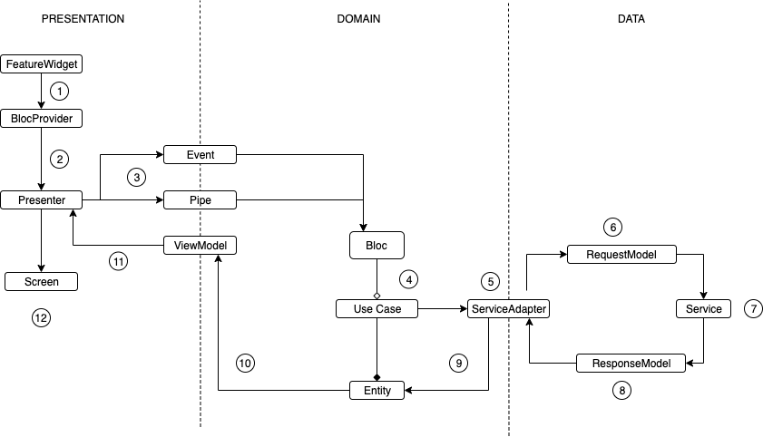

# Components Ecosystem

## Notes on the diagram
1. A Feature widget creates BlocProvider to insert the Bloc instance into the context, in order for
the presenter to be able to interact with it. This normally happens on the buildWhenAvailable method.
2. The Presenter handles the interactions with the Bloc and passes the ViewModel to the Screen.
3. Presenters talk to Blocs through Events and Pipes. When a ViewModel pipe is attached, it
automatically calls the onListen method of the ViewModel pipe. Blocs can use this to initiate Use Cases.
The first time the Screen is build, the content will be empty (unless the buildLoadingScreen method
is overriden).
4. A Bloc can contain multiple Use Cases. Each one should have a defined sequence of actions that
modifies the current data state in the Entity (services calls, dependencies with other libraries, etc).
5. ServiceAdapters handle the translation of depencency products (such as a ResponseModel) into data
in the Entity. An Entity could be created / updated during this process. Errors are also stored
in the Entity. A Use Case normally executes a Service Adapter to initiate an API call through a
Service. The type of Service will also determine how the error handling should happen.
6. As part of the execution of the Service, a RequestModel could be needed. The request is transformed
into body fields or URL parameters, depending on the HTTP Action.
7. A Service is executed. This is asynchronous and could produce errors. How this is handled depends
on the type of service. An Either Service returns an Either instance that includes a ResponseModel
on succes or an error on failure.
8. A ResponseModel is immutable that can have optional fields. A required field should be asserted.
9. The ServiceAdapter has a callback where the ViewModel can be generated on an EntityUpdate. This
is propagated to the Bloc by another callback.
10. The ViewModel is sent back to the Presenter through a pipe.
11. The Presenter invokes the buildScreen method where the received ViewModel data will be passed
down to the Screen.
12. Screen widgets receive the view model and functions that will be attached to UI actions (taps,
text changes, etc). The functions will be translated into pipes or events in the Presenter.